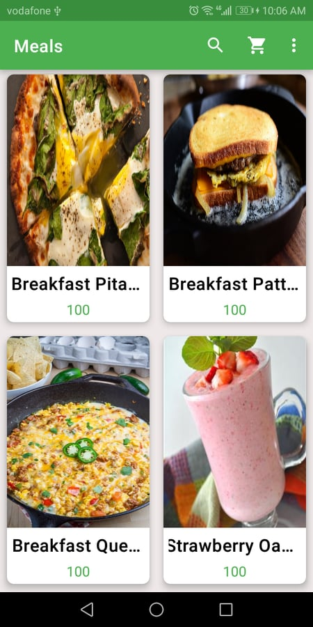
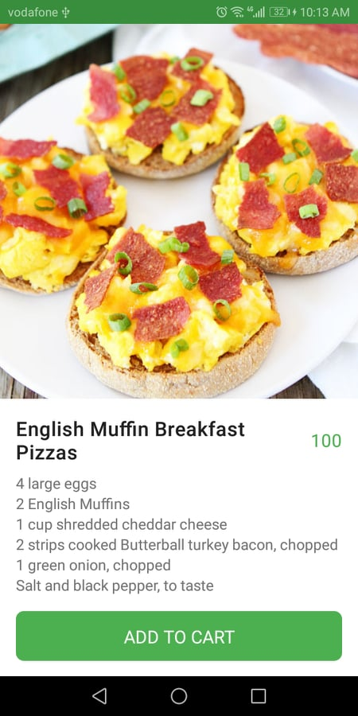
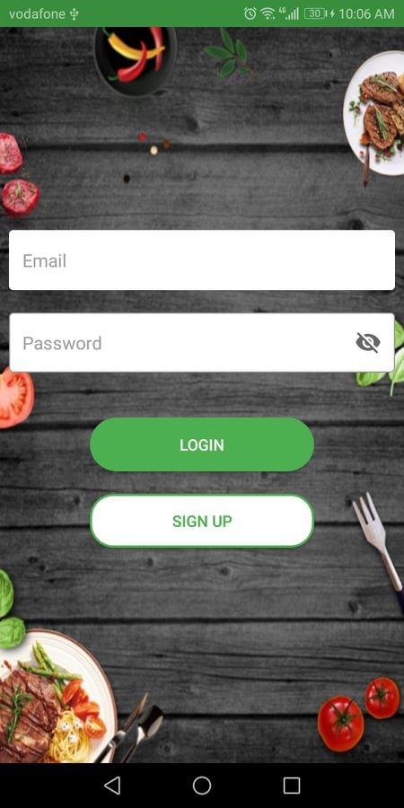
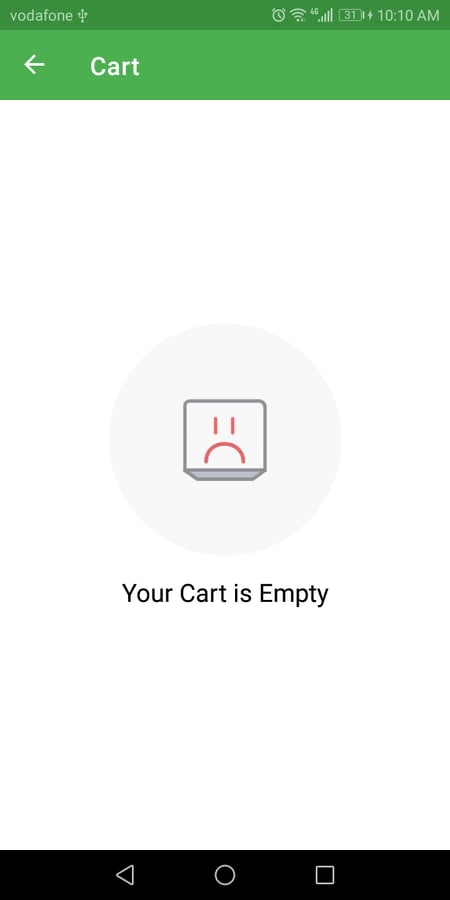

# ResDelivery-Koin-Coroutines-Mvvm-Single-Activity
this is a sample app for delivery that uses Hilt(previously koin) , Single activity , Navigation components , Google maps api , Mvvm , LiveData , Data binding , Retrofit , Coroutine  the idea is 
the user signs in to save the meals he wants to have then complete the order by seeing a map showing his current location to deliver the order
Meals            |  Detail
:-------------------------:|:-------------------------:
 | 

Cart            |  Map
:-------------------------:|:-------------------------:
 | 

Login            |  Empty Cart
:-------------------------:|:-------------------------:
 | 
